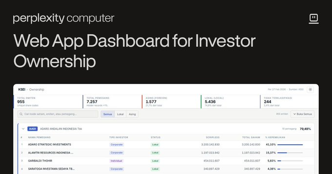

# KSEI Ownership Dashboard

A **1% ownership dashboard** based on KSEI (Kustodian Sentral Efek Indonesia) data, allowing users to explore stock ownership records in the Indonesian capital market.

## About the Project

In line with OJK Commissioner's Decree No. 1/KDK.04/2026, PT Bursa Efek Indonesia (BEI) and PT Kustodian Sentral Efek Indonesia (KSEI) were designated as official providers of public shareholding data for listed companies. On 3 March 2026, BEI and KSEI jointly published ownership data for shareholdings **above 1%** in all listed companies.

This information is provided by KSEI and published monthly through the BEI website. It is structured to give investors and stakeholders a transparent view of the ownership composition of publicly listed companies, supporting more informed investment decisions and strengthening the integrity of Indonesia's capital market.

> *Source: [BEI & KSEI Press Release — PR No. 022/BEI.SPR/3-2026 / PR-004/KSEI/SKE/0226 (3 March 2026)](https://www.idx.co.id/id/berita/siaran-pers/2577)*

## Data Source

Ownership data is sourced from the official KSEI archive:
📂 [KSEI Holding Composition Archive](https://web.ksei.co.id/archive_download/holding_composition)

## Credits & Origin

This project was exported from the original Perplexity Computer app:
🔗 [KSEI Ownership Dashboard](https://www.perplexity.ai/computer/a/ksei-ownership-dashboard-HsBJyN._SuGANEXd2Pl_kQ)

**Original Creator:** kangritel
- 🐦 X (Twitter): [@kr39__](https://x.com/kr39__)
- ☕ Support / Donation: [saweria.co/kr39](https://saweria.co/kr39)

> **Original Tweet:**
> 1% ownership dashboard based on KSEI data
> Feel free to check it here:
> 
> https://perplexity.ai/computer/a/ksei-ownership-dashboard-HsBJyN._SuGANEXd2Pl_kQ
> 
> Thanks to @AskPerplexity for the amazing Perplexity Computer

---

Made with Perplexity Computer
